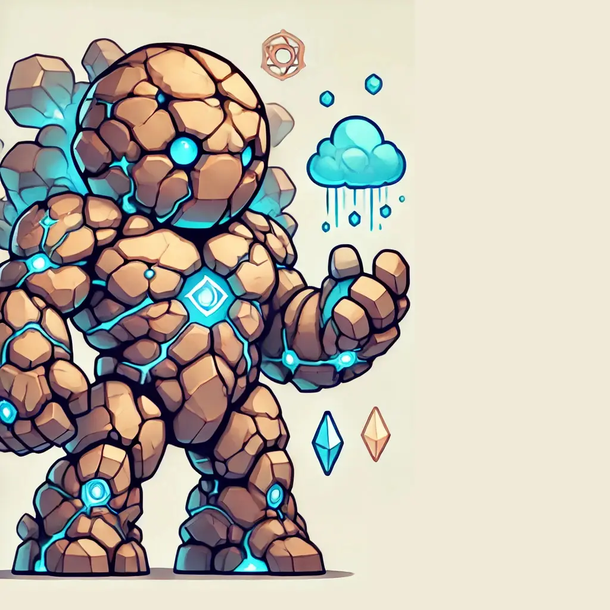

# TerraTitan



> Convert AWS CDK Constructs to Terraform-CDK using LLM

TerraTitan is an LLM-powered workflow that converts AWS CDK constructs to Terraform CDK (CDKTF). This tool is a major component used to generate the TerraConstructs library, providing reliable and trustworthy infrastructure components for everyone to use.

## 🌟 Features

- Automated conversion of AWS CDK constructs to Terraform CDK
- Vector database for storing and retrieving conversion patterns
- Unit and integration tests to ensure reliability
- CLI tool for easy interaction
- Compatible with both simple and complex AWS constructs

## 🚀 Getting Started

### Prerequisites

- Node.js v22 or later
- pnpm
- Anthropic API key
- DataStax Vector Database credentials

### Installation

```bash
# Clone the repository
git clone https://github.com/yourusername/TerraTitan.git
cd TerraTitan

# Install dependencies
pnpm install

# Set up environment variables
cp .env.example .env
# Edit .env with your API keys
```

### Usage

```bash
# Run the CLI
pnpm start convert --source path/to/awscdk/construct --output path/to/output

# Or use the library in your code
import { convertConstruct } from 'terra-titan';

const result = await convertConstruct(awscdkConstructPath);
```

## 🧪 Testing

```bash
# Run unit tests
pnpm test

# Run integration tests
pnpm test:integration
```

## 🏗️ Architecture

TerraTitan uses a multi-step process to convert AWS CDK constructs:

1. **Parse** - Extract the structure and properties of the AWS CDK construct
2. **Vectorize** - Create embeddings of the construct for similarity matching
3. **Match** - Find similar patterns in the vector database
4. **Generate** - Use Anthropic's Claude to generate the Terraform CDK equivalent
5. **Validate** - Run tests to ensure the generated code works as expected

## 🤝 Contributing

Contributions are welcome! Please feel free to submit a Pull Request.

## 📄 License

This project is licensed under the GPL-3.0 License - see the [LICENSE](LICENSE) file for details.

## 🙏 Acknowledgments

- Presented at DevOpsDay Singapore 2025 by Charles Martinot and Vincent De Smet
- Powered by Anthropic API and DataStax Vector Database
